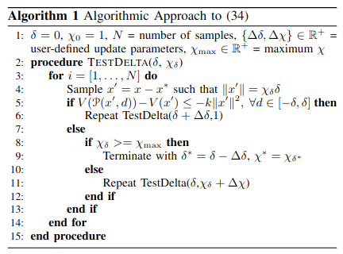

# deltaRobustness
This repository includes the code to algorithmically check $\delta$-robustness, as well as its application towards validating $\delta$-robustness for a bipedal walking gait.

## Setup
The periodic orbits were generated using a modification of the FROST Toolbox ([Modified Toolbox](https://github.com/maegant/frost-multiimpact), [Original Toolbox](http://ayonga.github.io/frost-dev/)). Therefore, the modified toolbox is imcluded in the repository since it is needed to run the simulation code. 
```
git clone --recursive https://github.com/maegant/deltaRobustness.git
```

## Main Script
To run the code, use the `main_script.m` script. I suggest running each section individually since some sections take several minutes to run and the figures may overwrite

## Main Algorithm
The main implementation of the $\delta$-robustness optimization is contained within the @TestRobustness class in the function `RunAlgorithm`. Explicitly, the algorithm is as follows:

<p align="center">
  
</p>

